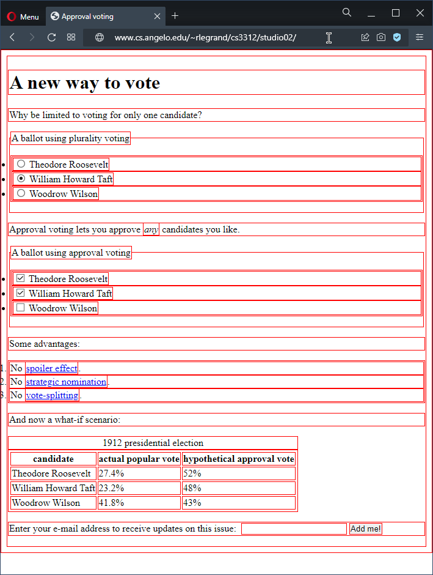
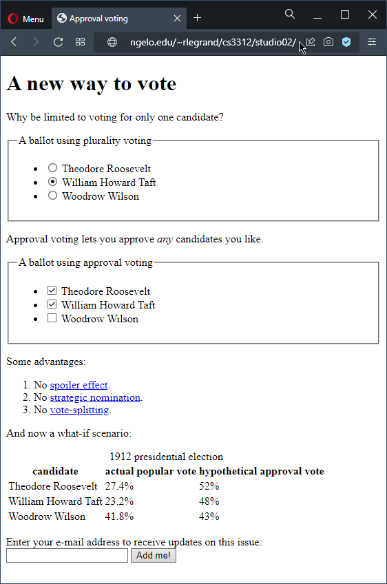

# Studio 2: HTML5 basics
Follow the instructions below.  Explain the code that you write using comments.  The Mozilla Developer Network and DevDocs may be helpful.  Don't hesitate to get help from me when you need it.

1. Open your P:\cs3312 folder.  Inside it, create a new folder named studio02.
2. Save the following file to your P:\cs3312\studio02 folder by right-clicking on the filename and selecting Save link as. example.html
3. Open example.html in Notepad++.  Don't forget to change the tab settings: tab size 3 and replace by space.  Add your name where indicated near the top.  Take note of the various HTML elements and how they are marked up.  Things to notice:
   - There are many HTML elements available to use.  Some are new in HTML5.
   - Different HTML elements have different semantics (inherent meanings) and different default appearances.  It's best to use elements only according to their correct semantics.  In other words, you should choose an element based on what it means and not based on how it looks.
   - Most HTML elements are block-level—they have their own block-shaped area that can stretch across the document.
   - Some HTML elements are inline—they only take up the area they need inside other elements.
   - Two elements have no inherent meaning and should be used when no existing HTML element is appropriate.  A div is a generic block-level element and a span is a generic inline element.
   - HTML character entities are useful to display characters such as < and &.
   - Take note of all the comments in the code and what they tell you about the various elements.  Remember that meaning is more important than presentation in HTML—you can always change the way elements look using CSS.
4. Open example.html in a standards-compliant browser such as Firefox, Chrome or Opera.  The browser will display it using default styling.  Take the time to look at each element in the HTML code and see how it is displayed in the browser.
5. Save the following file to your P:\cs3312\studio02 folder. 
   style.css
6. Reload example.html in the browser.  The browser will use the rules in style.css to style the page, giving every element a thin red border to make its size and shape obvious.  Notice how space is given to block-level and inline elements differently.  For example, a p element stretches all the way to the right even if it isn't full of text.  Again, take the time to look at each element in the HTML code and see how it is displayed in the browser, making sure there are no surprises.
7. Save the following file to your P:\cs3312\studio02 folder.
        index.html
8. Change the code in index.html to make the document look as much like the below examples as possible.  Helpful information:
   - You shouldn't change style.css in any way.
   - Don't forget to change the title of the page.
   - Make sure the radio buttons and checkboxes work correctly and have the defaults pictured below.  For example, when your page is loaded, William Howard Taft should be the only radio button selected, and if you click a different radio button William Howard Taft should be unselected.
   - Here are the URLs that should be used for the three links:
    [https://en.wikipedia.org/wiki/Spoiler_effect](https://en.wikipedia.org/wiki/Spoiler_effect)
    [https://en.wikipedia.org/wiki/Strategic_nomination](https://en.wikipedia.org/wiki/Strategic_nomination)
    [https://en.wikipedia.org/wiki/Vote_splitting](https://en.wikipedia.org/wiki/Vote_splitting)
   - Notice the difference between th and td elements.  Also be sure to include a scope attribute for each th element to specify whether it's the header of a row ("row") or of a column ("col").
   - The input element should have a type of email.
When you are finished and open index.html in a browser, it should look something like:

  

or, if the window size is different and all CSS rules are turned off,

  

Test your code in as many different browsers and window sizes as you can, and validate your index.html file using the W3C markup validator.  Please get help when you need it.

9. Make sure that you have written a brief but helpful comment for each major part in your index.html.  Why did you choose the elements you did?  Also be sure to include the names of any students you exchanged help with or talked to in comments in your code.
10. Once you're ready to turn in index.html, zip it up into a compressed file named studio02.zip:

    - In your P:\cs3312\studio02 folder, select index.html.
    - Right-click on it and select Send to and then Compressed (zipped) folder.
    - Rename the new file studio02.zip.

11. Turn in your studio02.zip file using Blackboard.