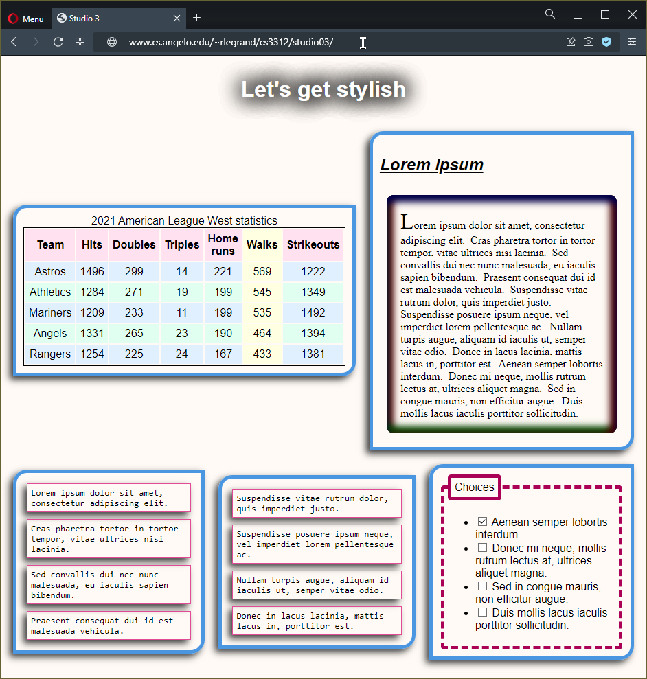
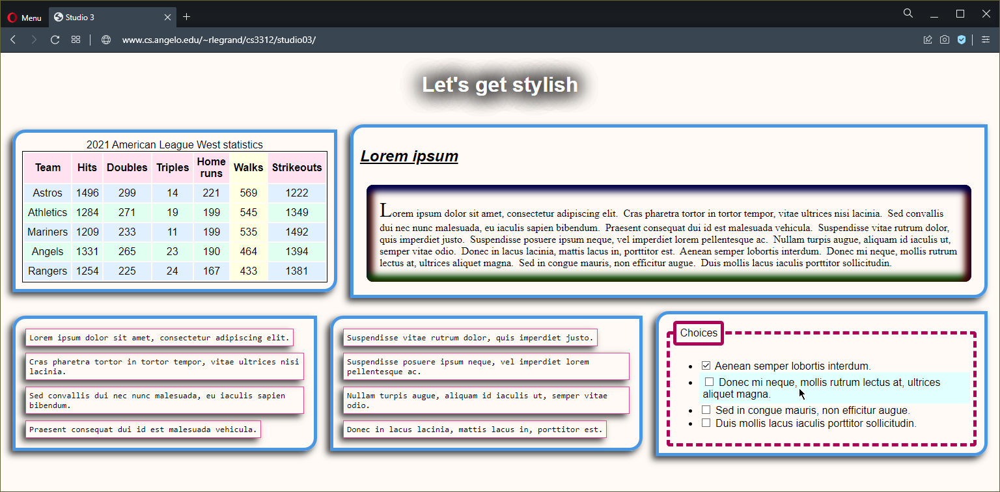

CS 3312: Web Programming, spring 2022

Studio 3: CSS3 basics

Follow the instructions below.&nbsp; <strong>Explain the code that you write using comments.</strong>&nbsp; The <a href="https://developer.mozilla.org/en-US/docs/Web">Mozilla Developer Network</a> and
<a href="https://devdocs.io/">DevDocs</a> may be helpful.&nbsp; Don't hesitate to get help from me when you need it.

<ol>
<li>Learn the basics of <a href="https://developer.mozilla.org/en-US/docs/Learn/CSS/Building_blocks/Selectors">CSS selectors</a> with <a href="https://flukeout.github.io/">CSS Diner</a>.&nbsp; Some selectors are more
important than others, but I recommend that you pass at least through Level 26 before moving on.</li>
<li>Learn the basics of <a href="https://developer.mozilla.org/en-US/docs/Web/CSS/CSS_Flexible_Box_Layout/Using_CSS_flexible_boxes">CSS flexible boxes</a> with
<a href="https://flexboxfroggy.com/">Flexbox Froggy</a>.&nbsp; Some properties are more important than others, but I recommend that you pass at least through Level 13 before moving on.&nbsp; Notice
<a href="https://css-tricks.com/snippets/css/a-guide-to-flexbox/">which properties apply to the containing elements and which properties apply to the elements inside</a>.</li>
<li>Open your <code>P:\cs3312</code> folder.&nbsp; Inside it, create a new folder named <code>studio03</code>.</li>
<li>Save the following file to your <code>P:\cs3312\studio03</code> folder by right-clicking on the filename and selecting <strong>Save link as</strong>.
   <ul>
   <li><code><a href="start/example.html">example.html</a></code></li>
   </ul>
</li>
<li>Open <code>example.html</code> in Notepad++.&nbsp; Don't forget to change the tab settings: tab size 3 and replace by space.&nbsp; Take note of the structure of the HTML document, especially which elements are inside
which other elements and which classes are applied to them.</li>
<li>Open <code>example.html</code> in a standards-compliant browser such as Firefox, Chrome or Opera.&nbsp; The browser will display it using default styling.</li>
<li>Save the following file to your <code>P:\cs3312\studio03</code> folder.
   <ul>
   <li><code><a href="start/example.css">example.css</a></code></li>
   </ul>
</li>
<li>Open <code>example.css</code> in Notepad++.&nbsp; For each CSS selector, predict exactly which HTML elements its rules will apply to.&nbsp; Some selectors, properties and values have been in
<a href="https://developer.mozilla.org/en-US/docs/Web/CSS">CSS</a> for a long time, like the <code><a href="https://developer.mozilla.org/en-US/docs/Web/CSS/background-color">background-color</a></code> property, and
some are new to CSS3, like the <code><a href="https://developer.mozilla.org/en-US/docs/Web/CSS/box-shadow">box-shadow</a></code> property.</li>
<li>Reload <code>example.html</code> in the browser.&nbsp; The browser will use the rules in <code>example.css</code> to style the page.&nbsp; Take the time to look at each element in the HTML code and see how it is
displayed in the browser.&nbsp; Find the specific effects of each CSS rule in <code>example.css</code>.&nbsp; You should experiment with changing the rules (changing colors, sizes, etc.) to help you figure out exactly
what effects each rule has.&nbsp; Also try it in different browsers; they may render some things a bit differently.</li>
<li>Save the following files to your <code>P:\cs3312\studio03</code> folder.
   <ul>
   <li><code><a href="start/index.html">index.html</a></code></li>
   <li><code><a href="start/style.css">style.css</a></code></li>
   </ul>
</li>
<li>Open <code>index.html</code> in Notepad++.&nbsp; Take note of the structure of the HTML document, especially which elements are inside which other elements and which classes are applied to them.</li>
<li>Open <code>style.css</code> in Notepad++.&nbsp; Add your name where indicated near the top.&nbsp; Change the code in <code>style.css</code> to make the document look as much like the below examples as possible.&nbsp;
Helpful information:
   <ul>
   <li>You shouldn't change <code>index.html</code> in any way.</li>
   <li>Whenever you use the <code><a href="https://developer.mozilla.org/en-US/docs/Web/CSS/font-family">font-family</a></code> property, you should provide a prioritized, comma-separated list of font names (such as
   <code>Georgia</code> and <code>"Century Gothic"</code>) ending with a generic font family (<code>serif</code>, <code>sans-serif</code>, <code>monospace</code>, <code>cursive</code> or <code>fantasy</code>).</li>
   <li>Try to match colors as closely as you can.&nbsp; Notice that the background of the page isn't exactly white.</li>
   <li>You may have to experiment with all the selectors, properties and values you've seen to get things looking correct.</li>
   </ul>
When you are finished and open <code>index.html</code> in a browser, it should look something like
  

or, if the window size is different and one of the checkbox items is hovered over,  

Test your code in as many different browsers and window sizes as you can, and validate your <code>style.css</code> file using the
<a href="https://jigsaw.w3.org/css-validator/#validate_by_input">W3C CSS validator</a>.&nbsp; Please get help when you need it.&nbsp; When CSS rules conflict, it may help to take into account selector
<a href="https://developer.mozilla.org/en-US/docs/Web/CSS/Specificity">specificity</a> and the <a href="https://developer.mozilla.org/en-US/docs/Web/CSS/Cascade">cascade</a> to figure out which CSS rules actually take
effect.</li>
<li>Make sure that you have written a brief but helpful comment for each major part in your <code>style.css</code>.&nbsp; Why did you target the elements and write the rules you did?&nbsp; <strong>Also be sure to include
the names of any students you exchanged help with or talked to in comments in your code.</strong></li>
<li>Once you're ready to turn in <code>style.css</code>, zip it up into a compressed file named <code>studio03.zip</code>:
   <ul>
   <li>In your <code>P:\cs3312\studio03</code> folder, select <code>style.css</code>.</li>
   <li>Right-click on it and select <strong>Send to</strong> and then <strong>Compressed (zipped) folder</strong>.</li>
   <li>Rename the new file <code>studio03.zip</code>.</li>
   </ul>
</li>
<li>Turn in your <code>studio03.zip</code> file using <a href="https://angelo.blackboard.com/">Blackboard</a>.</li>
</ol>

